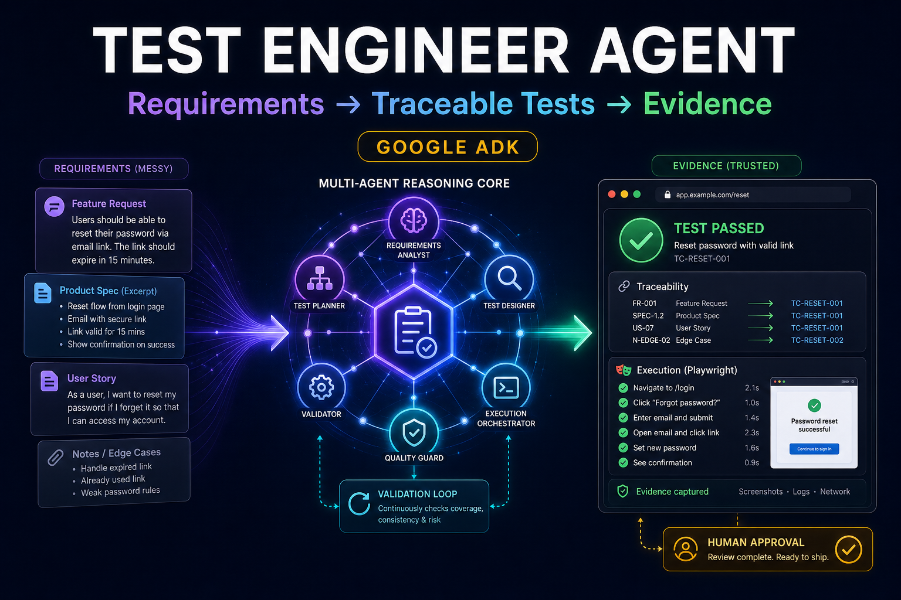
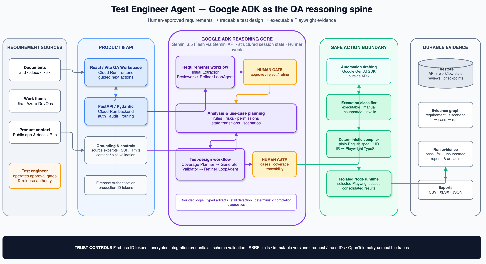

# Test Engineer Agent

> From messy requirements to executable evidence—before the next release.



[Live application](https://test-engineer-agent.maswadkar.com/) ·
[Architecture diagram](docs/assets/test-engineer-agent-architecture.png) ·
[Editable diagram source](docs/assets/test-engineer-agent-architecture.drawio) ·
[Devpost submission package](docs/hackathon/all-things-agentic-submission.md)

Test Engineer Agent is a policy-bounded AI QA teammate that converts fragmented
requirements and public product context into source-linked use cases, coverage
plans, structured test cases, executable Playwright candidates, and durable run
evidence. Google ADK powers the reasoning and quality-control workflows; typed
contracts and deterministic services compile, execute, persist, and audit the
results while humans retain approval authority.

## Why Google ADK

This is not a single-prompt wrapper. The requirements workflow combines an
extractor with a reviewer/refiner `LoopAgent`; the test-design workflow composes
analysis, coverage planning, generation, validation, and refinement through
`SequentialAgent` and `LoopAgent` orchestration. ADK session state carries typed
artifacts between specialists, `Runner` event streams expose agent-level
diagnostics, and `ToolContext` provides bounded exit conditions for review
loops.

Agents handle ambiguity, risk analysis, coverage, and test design. Pydantic
contracts, schema validation, deterministic fallbacks, a structured
intermediate representation, execution classification, and the Playwright
compiler control what may become executable. Unsupported or ambiguous cases
remain visible instead of being converted into misleading automation.

## How it works

1. Import Markdown, Word, Excel, Jira, or Azure DevOps requirements.
2. ADK agents extract, review, and refine testable requirements.
3. A test engineer approves the normalized source-linked requirements.
4. Public product context grounds rules, UI facts, risks, and use-case planning.
5. ADK agents plan coverage, generate cases, and run bounded critique loops.
6. Reviewers inspect traceability, scenario coverage, and diagnostics.
7. Deterministic services classify, compile, and run supported Playwright cases.
8. Firestore-backed project snapshots preserve reviews, runs, and report evidence.

## Architecture



The blue boundary is the Google ADK reasoning core. Automation drafting through
the Google Gen AI SDK and deterministic Playwright compilation/execution are
shown outside that boundary so the diagram does not overstate ADK's role. See
the [editable draw.io source](docs/assets/test-engineer-agent-architecture.drawio)
and the detailed [architecture documentation](docs/codebase/ARCHITECTURE.md).

## Validation evidence

| Evidence | Recorded result |
| --- | --- |
| Backend regression suite | 375 tests passed |
| Strict offline requirements evaluation | Score 100 against an 85 threshold on both fixtures |
| Strict offline generation evaluation | Score 100 against a 90 threshold with 1.00 scenario and requirement traceability |
| Strict orchestrator evaluation | 3/3 fixtures passed with 1.00 impact precision and preservation |
| Recorded grounded Playwright workflow | 31 approved cases, 20 executable candidates, and 5/5 selected browser checks passed |
| Protected Home-first browser gate | 130/130 tests passed; ten Axe scans found no serious or critical issues without exclusions |

The evaluation fixtures and many browser gates are intentionally deterministic
or synthetic; they are regression evidence, not claims of production accuracy.
Commands and provenance are recorded in
[`docs/codebase/TESTING.md`](docs/codebase/TESTING.md) and
[`docs/requirements_traceability.md`](docs/requirements_traceability.md).

## Hackathon disclosure

This repository contains substantial pre-existing work. Its first commit is
dated February 4, 2026, before the All Things Agentic Hackathon submission
period began on August 3, 2026. The architecture, application, ADK workflows,
integrations, persistence, execution runtime, tests, and initial production
deployment were substantially developed before the contest. The August 18,
2026 contest-period change modernized dependencies. This submission does not
represent the pre-existing implementation as newly created during the
hackathon. See the full
[submission disclosure](docs/hackathon/all-things-agentic-submission.md#pre-existing-work-disclosure).

## Features

- Firebase Authentication sign-in with Google, Microsoft, and Apple providers when enabled
- Upload requirements (.md, .docx, .xlsx)
- Parse and extract requirement items
- Import and sync requirements from JIRA Cloud issues
- Import and sync requirements from Azure DevOps Services work items
- Analyze context links (app, prototype, diagrams, images) into grounded UI/API/workflow facts
- Generate test cases from a user template with requirement-analysis, scenario-plan, and coverage diagnostics
- Preview generated test cases for browser automation readiness and run approved executable candidates with Playwright
- Raw uploaded documents are processed in memory; durable projects retain derived workflow snapshots, review decisions, runs, and report evidence

## Documentation Map

The GitHub Wiki is the reader-facing documentation hub for long-form
architecture, testing, integration, concern, and project-tracking material:
[Home](https://github.com/lumensparkxy/agentic_test_case_generator/wiki),
[Architecture](https://github.com/lumensparkxy/agentic_test_case_generator/wiki/Architecture),
[Testing and Validation](https://github.com/lumensparkxy/agentic_test_case_generator/wiki/Testing-and-Validation),
[Integrations](https://github.com/lumensparkxy/agentic_test_case_generator/wiki/Integrations),
[Concerns and Risks](https://github.com/lumensparkxy/agentic_test_case_generator/wiki/Concerns-and-Risks),
and [Project Tracking](https://github.com/lumensparkxy/agentic_test_case_generator/wiki/Project-Tracking).
The source-controlled docs below remain checked in for code-coupled review and
PR history.

- `docs/codebase/STACK.md` describes runtimes, dependencies, commands, and environment configuration.
- `docs/codebase/STRUCTURE.md` maps source directories, entry points, and module boundaries.
- `docs/codebase/ARCHITECTURE.md` explains the backend, frontend, agent, integration, and execution-runtime flow.
- `docs/codebase/CONVENTIONS.md` captures naming, routing, error handling, logging, and testing conventions.
- `docs/codebase/INTEGRATIONS.md` inventories Firebase, Gemini/ADK, Firestore, JIRA, Azure DevOps, Playwright, and observability integrations.
- `docs/codebase/TESTING.md` lists validation gates and folds in the reproducible Playwright documentation E2E workflow for the next version.
- `docs/codebase/CONCERNS.md` records high-churn areas, technical debt, security/scaling concerns, and open architecture questions.
- `docs/production-auth-policy-decision.md` records the accepted production auth policy: Firebase ID tokens in production, backend JWTs only for explicit local/E2E compatibility.
- `docs/artifact-fetching-threat-model.md` defines the accepted public, unauthenticated remote artifact fetching boundary and SSRF controls.
- `docs/credential-rotation-runbook.md` documents rotation steps for JIRA tokens, Azure DevOps PATs, JWT/Gemini/Firebase secrets, and Cloud Run Secret Manager entries.

## Setup

### 1) Configure environment
Copy .env.example to .env and set values:
- GEMINI_API_KEY (required)
- MODEL_NAME (default: gemini-3.5-flash)
- PARALLEL_TEST_CASE_GENERATION_ENABLED, PARALLEL_TEST_CASE_MIN_SCENARIOS, PARALLEL_TEST_CASE_MAX_WORKERS, PARALLEL_TEST_CASE_TARGET_SCENARIOS_PER_SHARD, PARALLEL_TEST_CASE_MAX_SHARDS (optional tuning for bounded parallel generation from approved coverage plans)
- PARALLEL_AUTOMATION_GENERATION_ENABLED, PARALLEL_AUTOMATION_MIN_CASES, PARALLEL_AUTOMATION_MAX_WORKERS (optional tuning for bounded automation fragment generation)
- GOOGLE_CLIENT_ID (optional; required only for compatibility-mode `/auth/google/login`)
- GOOGLE_CLIENT_IDS (optional compatibility-mode comma-separated allow-list for multiple web client IDs)
- FIREBASE_PROJECT_ID (recommended for Firebase Admin initialization)
- FIREBASE_SERVICE_ACCOUNT_JSON (optional for local containers or non-GCP runtimes)
- GOOGLE_APPLICATION_CREDENTIALS (optional alternative for the deploy helper; use an absolute path to a local Firebase Admin SDK JSON file)
- JWT_SECRET_KEY (required for local/E2E compatibility tokens and fallback integration-secret encryption)
- JWT_ALGORITHM (default: HS256)
- JWT_EXPIRATION_MINUTES (default: 60)
- AUTH_TOKEN_MODE (`firebase-only` for production; `firebase-or-backend-jwt` only for local/E2E compatibility)
- METRICS_ENABLED (defaults to true locally; Cloud Run deploy helper defaults to false)
- METRICS_ACCESS_TOKEN (optional bearer token required for `/metrics` when set; required by the deploy helper if `METRICS_ENABLED=true`)
- AUDIT_DEAD_LETTER_BACKEND (optional; defaults to local in-memory summaries; set to `firestore` for a durable Firestore sink)
- AUDIT_DEAD_LETTER_COLLECTION (optional Firestore collection for sanitized dead-letter summaries; defaults to `audit_dead_letters`)
- VITE_GOOGLE_CLIENT_ID (optional compatibility-mode Google client ID hint)
- VITE_FIREBASE_API_KEY (required for frontend sign-in button)
- VITE_FIREBASE_AUTH_DOMAIN (required for frontend sign-in button)
- VITE_FIREBASE_PROJECT_ID (required for frontend sign-in button)
- VITE_FIREBASE_APP_ID (required for frontend sign-in button)
- VITE_FIREBASE_STORAGE_BUCKET, VITE_FIREBASE_MESSAGING_SENDER_ID, VITE_FIREBASE_MEASUREMENT_ID (recommended to mirror your Firebase web app config)
- VITE_FIREBASE_ENABLE_GOOGLE_AUTH, VITE_FIREBASE_ENABLE_MICROSOFT_AUTH, VITE_FIREBASE_ENABLE_APPLE_AUTH (optional provider toggles; default true)
- JIRA_CONNECTION_SECRET_KEY (optional dedicated encryption key for stored JIRA API tokens; falls back to JWT_SECRET_KEY)
- JIRA_CONNECTION_PREVIOUS_SECRET_KEYS (optional comma-separated previous JIRA encryption keys for read-only rotation support)
- AZURE_DEVOPS_CONNECTION_SECRET_KEY (optional dedicated encryption key for stored Azure DevOps PATs; falls back to JWT_SECRET_KEY)
- AZURE_DEVOPS_CONNECTION_PREVIOUS_SECRET_KEYS (optional comma-separated previous Azure DevOps encryption keys for read-only rotation support)
- AZURE_DEVOPS_API_VERSION (optional; defaults to 7.1)
- AZURE_DEVOPS_API_TIMEOUT_SECONDS, AZURE_DEVOPS_PROJECT_PAGE_SIZE, AZURE_DEVOPS_WORK_ITEM_PAGE_SIZE (optional Azure DevOps client tuning)
- EXECUTION_ENABLED (optional; defaults to true)
- EXECUTION_ARTIFACT_ROOT (optional; defaults to `.execution_artifacts`)
- EXECUTION_DEFAULT_BASE_URL (optional browser execution target)
- EXECUTION_PLAYWRIGHT_CONFIG, EXECUTION_RUNTIME_CWD, EXECUTION_MAX_CASES_PER_REQUEST, EXECUTION_BROWSER_CHANNEL (optional execution runtime tuning)
- BILLING_SHADOW_MODE (optional; defaults to true), BILLING_CONTACT_EMAIL, BILLING_ADMIN_EMAILS, BILLING_PILOT_REQUIREMENTS_LIMIT, BILLING_PILOT_TEST_CASE_LIMIT, and related billing tuning values

Note: ADK expects GOOGLE_API_KEY. Configure GEMINI_API_KEY in this project; the backend normalizes it to GOOGLE_API_KEY at runtime. If both are set, GEMINI_API_KEY is preferred so the project `.env` does not get shadowed by an older shell-level GOOGLE_API_KEY.

Production protected endpoints use Firebase ID tokens. Local and E2E workflows
that mint backend JWTs require `AUTH_TOKEN_MODE=firebase-or-backend-jwt`; keep
production deployments on `AUTH_TOKEN_MODE=firebase-only`.

Credential rotation procedures for user integration tokens, encryption keys,
Gemini keys, Firebase credentials, JWT secrets, metrics tokens, and Cloud Run
Secret Manager entries are documented in
[docs/credential-rotation-runbook.md](docs/credential-rotation-runbook.md).

For compatibility-mode Google login, set `GOOGLE_CLIENT_ID` and
`VITE_GOOGLE_CLIENT_ID` to the same OAuth web client ID. If you intentionally
use different client IDs across environments or builds, add all valid IDs to
`GOOGLE_CLIENT_IDS`.

### 1.1) Compatibility-mode Google OAuth quick setup (local dev only)

Use this only if you intentionally test `/auth/google/login` with
`AUTH_TOKEN_MODE=firebase-or-backend-jwt`. Production sign-in uses Firebase Auth
provider configuration instead.

1. Create/select a Google Cloud project.
2. Configure OAuth consent screen.
3. Create OAuth 2.0 Client ID of type **Web application**.
4. Add Authorized JavaScript origins:
	- `http://localhost:5173`
	- `http://127.0.0.1:5173`
5. Copy the generated client ID into `.env` as both:
	- `GOOGLE_CLIENT_ID`
	- `VITE_GOOGLE_CLIENT_ID`

If you also run a deployed frontend with a different Google OAuth web client, add both client IDs to `GOOGLE_CLIENT_IDS` as a comma-separated list.

### 1.2) Azure DevOps integration setup

Azure DevOps access is stored as a per-user integration connection, separate from the app login session. The first implementation uses Azure DevOps Personal Access Tokens so both work/school organization accounts and personal Microsoft accounts can connect.

For each user connection:

1. Sign in to the app.
2. Create an Azure DevOps PAT in the target organization/account with the smallest useful scopes:
	- Project and team: read
	- Work items: read/write
3. Connect using an Azure DevOps organization or project URL, for example:
	- `https://dev.azure.com/{organization}`
	- `https://dev.azure.com/{organization}/{project}`
4. If a project URL is supplied, the backend normalizes it to the organization URL and remembers the project as the default project for that connection.

The backend encrypts stored PATs using `AZURE_DEVOPS_CONNECTION_SECRET_KEY` when set, otherwise `JWT_SECRET_KEY`. Planned encryption-key rotation can stage previous read-only keys through `AZURE_DEVOPS_CONNECTION_PREVIOUS_SECRET_KEYS` and re-encrypt records with `python scripts/reencrypt_integration_credentials.py --apply`. Do not commit PATs to `.env.example`, tests, logs, or documentation.
See [docs/credential-rotation-runbook.md](docs/credential-rotation-runbook.md)
for per-user PAT rotation and encryption-key rotation behavior.

### 2) Backend

Create a Python 3.14 virtual environment and install deps:
- `python -m pip install -r backend/requirements.txt`
- `python -m pip install -r backend/requirements-dev.txt` for lint and format tooling

Run the API:
- `uvicorn app.main:app --reload --app-dir backend --reload-dir backend`

### 3) Frontend

Install deps:
- `npm ci` in frontend

Run UI:
- `npm run dev` in frontend

Open http://localhost:5173

### 3.0.1) Install the execution runtime

The Automation tab uses the backend execution runtime under `backend/execution_runtime`.

- `cd backend/execution_runtime`
- `npm ci`

The Playwright config uses your installed Microsoft Edge browser by default through `channel: "msedge"`. If Edge is not already installed on the machine, install Microsoft Edge or run:

- `npx playwright install msedge`

Generated execution files are written under `EXECUTION_ARTIFACT_ROOT` and ignored by git. Each execution run writes shared specs under
`generated/playwright/`, per-case IR under `ir/`, and one consolidated Playwright `results.json` plus `html-report` under
`artifacts/playwright/run/`. The internal handoff is generated `TestCase` JSON from the webapp, not Excel.

### 3.0.2) Clean generated artifacts

Generated execution and client-submission outputs can contain screenshots,
traces, reports, exports, generated specs, or client-sensitive data. Keep them
out of git and use the dry-run cleanup command before deleting anything:

```bash
python scripts/cleanup_generated_artifacts.py
```

The command scans `.execution_artifacts/`, `client_submission/`, and
`/tmp/pw_workflow_out` by default and selects files older than 14 days. Delete
the dry-run matches only after review:

```bash
python scripts/cleanup_generated_artifacts.py --apply
```

For real client or operational data, prefer a stricter window and delete local
artifacts as soon as the handoff is complete:

```bash
python scripts/cleanup_generated_artifacts.py --max-age-days 7 --apply
```

Use `--target` to override or add generated directories. In-repository targets
must be ignored by git unless `--allow-unignored-target` is passed, and tracked
files are skipped even with that override. See
[docs/artifact-retention-policy.md](docs/artifact-retention-policy.md).

### 3.1) Evaluate generation quality with benchmark fixtures

To measure the current test-case generator against the benchmark fixtures in `scripts/benchmark_inputs/`, run:

- `python scripts/evaluate_generation.py`

Useful options:

- `--offline` to force deterministic fallback mode even if model credentials are present
- `--strict` to fail the run when any expected benchmark trait is unmet
- `--output-json path/to/report.json` to save the benchmark report as JSON

If no `GOOGLE_API_KEY` or `GEMINI_API_KEY` is configured, the script automatically uses offline fallback mode and still reports structural baseline metrics.

### 3.1.1) Run backend regression tests

The current backend suite is written with `unittest` and does not require `pytest`:

- `python -m unittest discover -s backend/tests -p 'test_*.py'`

If you prefer pytest locally, install it separately; it is not required by the checked-in test suite today.

### 3.2) Evaluate requirement extraction quality with benchmark fixtures

To measure the requirements agent against the document-style benchmark fixtures in `scripts/benchmark_requirement_inputs/`, run:

- `python scripts/evaluate_requirements.py`

Useful options:

- `--offline` to force deterministic heuristic mode even if model credentials are present
- `--strict` to fail the run when any expected benchmark trait is unmet
- `--output-json path/to/report.json` to save the benchmark report as JSON

If no `GOOGLE_API_KEY` or `GEMINI_API_KEY` is configured, the script automatically uses offline fallback mode and still reports structural baseline metrics for extraction quality.

### 3.3) Export the API contract

To generate the current FastAPI OpenAPI schema for contract checks or frontend type generation, run:

- `python scripts/export_openapi.py --output /tmp/agentic-tcg-openapi.json`

Use this as the source for generated TypeScript clients/types instead of hand-copying response shapes into the frontend.

### 3.4) Run lint and format checks

Backend linting uses Ruff:

- `python -m ruff check backend scripts`
- `python -m ruff format --check backend scripts`

Frontend linting and formatting use ESLint and Prettier:

- `cd frontend && npm run lint`
- `cd frontend && npm run format:check`

CI enforces the backend Ruff lint/format checks and frontend ESLint/Prettier checks.

### 4) Run with containers on fixed local ports

If you want the containerized app to use the same local URLs every time, run it with Docker Compose from the repo root:

- `docker compose up --build`

This publishes:

- Frontend: `http://localhost:5173`
- Backend: `http://localhost:8000`

This is useful for compatibility-mode Google OAuth because you only need to authorize the standard local dev origins:

- `http://localhost:5173`
- `http://127.0.0.1:5173`

To stop the containers:

- `docker compose down`

### 5) Deploy both containers to Google Cloud Run

This repo includes a helper script that deploys both services as containers to Cloud Run and keeps them on scale-to-zero managed infrastructure.

Prerequisites:

- `gcloud` CLI installed and authenticated
- Docker installed and running
- Billing enabled on your GCP project
- A `.env` file with at least these values set:
	- `GEMINI_API_KEY`
	- `VITE_FIREBASE_API_KEY`
	- `VITE_FIREBASE_AUTH_DOMAIN`
	- `VITE_FIREBASE_PROJECT_ID`
	- `VITE_FIREBASE_APP_ID`
	- `JWT_SECRET_KEY`
	- `AUTH_TOKEN_MODE=firebase-only`
	- `CORS_ALLOW_ORIGINS` including every production frontend/custom-domain origin
	- `METRICS_ENABLED=false` or `METRICS_ENABLED=true` with `METRICS_ACCESS_TOKEN`
	- `JIRA_CONNECTION_SECRET_KEY` and `AZURE_DEVOPS_CONNECTION_SECRET_KEY` when production should use dedicated integration encryption keys
	- `JIRA_CONNECTION_PREVIOUS_SECRET_KEYS` and `AZURE_DEVOPS_CONNECTION_PREVIOUS_SECRET_KEYS` only during planned integration encryption-key rotation windows

Set your target project and optionally the region/repository/service names:

- `export PROJECT_ID=your-gcp-project-id`
- `export REGION=us-central1`
- `export ARTIFACT_REPO=agentic-tcg`
- `export BACKEND_SERVICE=tcg-backend`
- `export FRONTEND_SERVICE=tcg-frontend`

Run the deploy script from the repo root to bootstrap a new environment:

- `DEPLOY_MODE=bootstrap ./scripts/deploy_cloud_run.sh`

What the script does:

- enables Cloud Run, Artifact Registry, and Secret Manager APIs
- creates the Docker Artifact Registry repository if needed
- stores `GEMINI_API_KEY` and `JWT_SECRET_KEY` in Secret Manager
- requires and deploys `AUTH_TOKEN_MODE=firebase-only`
- deploys `METRICS_ENABLED=false` by default, or stores `METRICS_ACCESS_TOKEN` in Secret Manager when metrics are explicitly enabled
- optionally stores `FIREBASE_SERVICE_ACCOUNT_JSON` in Secret Manager when provided
- optionally stores `JIRA_CONNECTION_SECRET_KEY` and `AZURE_DEVOPS_CONNECTION_SECRET_KEY` in Secret Manager when provided
- optionally stores `JIRA_CONNECTION_PREVIOUS_SECRET_KEYS` and `AZURE_DEVOPS_CONNECTION_PREVIOUS_SECRET_KEYS` in Secret Manager when provided for staged re-encryption
- if `GOOGLE_APPLICATION_CREDENTIALS` points to a local Firebase Admin SDK JSON file, the deploy script reads that file and uploads it as the `FIREBASE_SERVICE_ACCOUNT_JSON` secret automatically
- builds and pushes the backend container
- deploys the backend to Cloud Run
- builds and pushes the frontend container with the deployed backend URL and Firebase web config baked in
- deploys the frontend to Cloud Run
- updates backend CORS to allow the deployed frontend URL
- runs backend health, frontend HTTP, and CORS preflight smoke checks

For an existing production environment, use the code-only release mode. It
requires clean synchronized `main`, verifies the live backend is still
`AUTH_TOKEN_MODE=firebase-only`, tags images with the current commit, preserves
existing environment variables/CORS/Secret Manager references/IAM/service
account policy, and updates only the backend/frontend images:

```bash
git fetch origin --prune
export DEPLOY_MODE=release
export CORS_SMOKE_ORIGINS=https://test-engineer-agent.maswadkar.com
./scripts/deploy_cloud_run.sh
```

The Home workspace also requires the three versioned composite indexes in
`firestore.indexes.json`. Follow
[`docs/home-workspace-production-rollout.md`](docs/home-workspace-production-rollout.md)
to validate and add the indexes, capture rollback revisions, deploy from
protected `main`, and run the authenticated read-only production smoke. Do not
run routine releases through bootstrap mode because bootstrap intentionally
updates secrets and infrastructure policy.

If you use Firebase Authentication with popup or redirect flows, also add the deployed frontend hostname (without `https://`) to Firebase Console -> Authentication -> Settings -> Authorized domains. For Cloud Run, this is typically both the canonical `*.a.run.app` hostname and the region-scoped `*.run.app` hostname shown by the deploy script.

If you intentionally test compatibility-mode Google OAuth in a non-production
environment, add that frontend URL as an Authorized JavaScript origin in the
Google OAuth web client used for the compatibility route.

## API Authentication
Accepted production policy is documented in `docs/production-auth-policy-decision.md`.
Protected endpoints accept Firebase ID tokens in `AUTH_TOKEN_MODE=firebase-only`.
Backend-issued JWTs and `/auth/google/login` are available only in
`AUTH_TOKEN_MODE=firebase-or-backend-jwt` for local/E2E compatibility.

- Public endpoints:
	- `GET /health`
	- `POST /auth/google/login` (compatibility mode only)
	- `GET /auth/me`
	- `POST /auth/logout`
	- `GET /metrics` only when `METRICS_ENABLED=true`; requires `Authorization: Bearer <METRICS_ACCESS_TOKEN>` when a metrics token is configured
- Protected endpoints (Bearer token required):
	- `/requirements/*`
	- `/testcases/*`
	- `/integrations/jira/*`
	- `/integrations/azure-devops/*`
	- `/export/*`
	- `/automation/*`

Frontend stores the access token in `localStorage` for the current MVP.

## Troubleshooting
- Backend fails with auth errors: verify `GEMINI_API_KEY` is set in [.env.example](.env.example) (copied to `.env`). The backend maps it to `GOOGLE_API_KEY` at runtime for ADK.
- Frontend cannot reach API: set `VITE_API_BASE` in `.env` or use the default from [.env.example](.env.example).
- Import errors after install: re-run `python -m pip install -r backend/requirements.txt` inside your active virtual environment.
- Backend restarts or crashes unexpectedly in local dev: make sure Uvicorn reload is limited to the backend source tree (`--reload-dir backend`) so it does not watch `.venv` or other workspace folders.
- Compatibility-mode Google sign-in fails with audience/issuer errors: verify `GOOGLE_CLIENT_ID` and `VITE_GOOGLE_CLIENT_ID` exactly match the same web OAuth client ID, or list every valid web client ID in `GOOGLE_CLIENT_IDS`.
- Login button missing: verify the Firebase web variables are present in `.env` and restart the frontend dev server.
- Requests return 401 after login: token may be expired or invalid; sign out/in again. For local JWT workflows, confirm `AUTH_TOKEN_MODE=firebase-or-backend-jwt` and `JWT_SECRET_KEY` are set.
- `/metrics` returns 404: set `METRICS_ENABLED=true` for local diagnostics or configure the deployment perimeter/token intentionally. `/metrics` returns 401 when `METRICS_ACCESS_TOKEN` is set and the bearer token is missing or wrong.
- Azure DevOps connection fails with 401/403: verify the PAT is active, belongs to an account with access to the organization, and includes Project/team read plus Work Items read/write scopes.
- Azure DevOps project import requires a project: use a project URL during connection or select/provide a project before searching/importing work items.

## Notes
- Requirement import/sync is implemented for JIRA Cloud and Azure DevOps Services. JIRA test-case export remains a backend stub.
- Playwright POM generation remains backend-only/experimental and is hidden in the current UI until the automation workflow is productized.
- Uploaded documents are processed in-memory and not stored
- Upload size is capped at 16 MB per file
