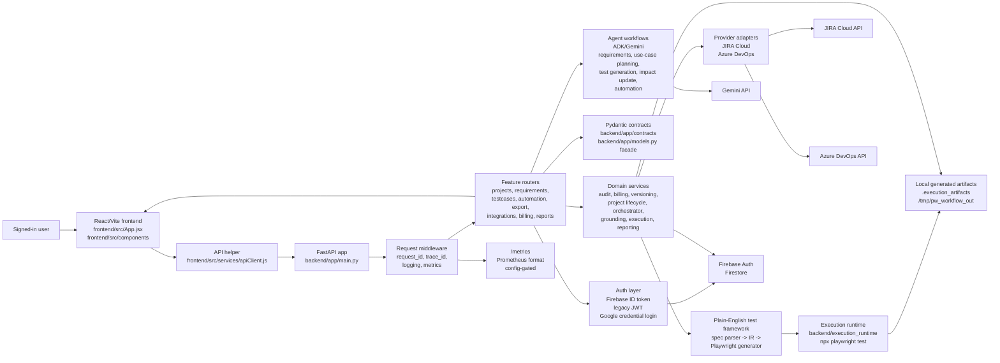

# Architecture

## 1) Architectural Style

Primary style: modular monolith with a layered backend, a React single-page
frontend, and an isolated Playwright execution runtime.

Why this classification:

- `backend/app/main.py` creates one FastAPI application and registers feature
  routers from `backend/app/routers/`.
- Routers delegate domain behavior to service modules, agent modules, adapters,
  and domain-owned Pydantic contracts in `backend/app/contracts/`.
  `backend/app/models.py` remains a compatibility facade for existing imports.
- The frontend is one Vite React app with `App.jsx` as top-level workflow
  orchestration and focused components under `frontend/src/components/`.
- Browser execution is split into a backend Python conversion/service path and
  a Node Playwright runtime under `backend/execution_runtime/`.

Primary constraints:

- User-facing workflow is human-in-the-loop: requirements are parsed/reviewed,
  context can be enriched, test cases are generated/reviewed, exports are gated,
  and execution candidates are previewed before running.
- Durable QA projects can now wrap the staged workflow so requirement, context,
  use-case, impact-analysis, test-case, execution, and report snapshots survive
  browser reloads.
- Orchestrator next actions are backed by stable specialist task contracts for
  requirements, use cases, impact, test cases, automation, execution, review,
  and reporting, with local adapters registered behind an ADK-compatible
  dispatcher boundary.
- Use-case planning is split from full test-case generation. The orchestrator
  `use_cases` specialist uses a bounded backend coordinator that shards
  requirements, merges requirement analysis and coverage plans centrally, and
  leaves project snapshot writes to the existing router/service flow.
- Human Use Cases review is a separate durable decision from generated content.
  `POST /projects/{id}/use-cases/reviews` records an approval or requested-change
  decision against the exact current snapshot and project revision without
  modifying the immutable snapshot body.
- Large test-case generation can reuse approved requirement-analysis and
  coverage-plan artifacts. A bounded backend coordinator shards planned
  scenarios by requirement group, runs draft-only workers, remaps duplicate
  `TC-*` IDs, restores coverage-plan order, and applies one suite-level
  heuristic review before the router records billing, usage, versions, or
  project snapshots.
- Planned scenario coverage is exact-ID first. Generated cases should preserve
  `scenario_refs` for every covered coverage-plan scenario; scenario-type
  inference remains a degraded compatibility fallback for legacy or malformed
  cases and is reported in workflow diagnostics.
- Deterministic test-case completion uses structured count diagnostics. Coverage
  completion reports missing requirements, missing must-have scenarios,
  optional/planned scenario gaps, must-have deterministic additions, optional
  deterministic additions, total additions, and a `completion_source` distinct
  from full deterministic fallback.
- Automation generation is assembled centrally from bounded component/page
  fragments. Workers may draft generated test modules only; shared project
  files, final paths, duplicate symbol handling, and case-level manual or
  unsupported diagnostics are owned by `backend/app/agents/automation_agent.py`,
  while `/automation/playwright` remains the audit and billing boundary.
- Orchestrator run records, timeline events, and checkpoints are persisted
  under QA projects so action progress, blockers, retries, produced snapshots,
  and execution links can resume after reloads or backend restarts.
- Agent output must be resilient: parsers, deterministic fallbacks, retry
  diagnostics, and heuristic quality gates protect the workflow from malformed
  model output.
- Source artifacts and credentials must not be retained in git. Generated
  execution artifacts, screenshots, exports, and client briefs are ignored.

## 2) Visual Architecture



The diagram shows the main request path and the two important side paths:
agent-backed generation through Gemini, and executable browser automation
through the plain-English framework plus the isolated Playwright runtime.

## 3) System Flow

```text
React UI -> FastAPI router -> billing/audit guard -> agent/service/adapters -> persistence repositories/Firestore/external API/local artifacts -> Pydantic response -> React UI
```

Typical generate flow:

1. The frontend sends authenticated API requests through helpers in
   `frontend/src/services/apiClient.js` and auth/session orchestration in
   `frontend/src/App.jsx`.
2. FastAPI middleware in `backend/app/main.py` attaches `X-Request-ID`, optional
   trace context, structured request logging, and HTTP metrics.
3. A router in `backend/app/routers/` resolves `AuthUser`, starts an audit
   workflow, checks billing where relevant, validates Pydantic request models,
   and delegates work.
4. Agent modules such as `backend/app/adk_client.py`,
   `backend/app/agents/analysis_agent.py`,
   `backend/app/agents/use_case_agent.py`, and
   `backend/app/agents/test_case_agent.py` orchestrate model calls, shard
   coordination, parsing, and workflow loops. Focused helper modules own
   coverage metrics, review scoring, deterministic fallback output, and
   response hydration.
5. Service modules persist audit/version/billing/integration metadata through
   repository boundaries and the shared Firestore adapter where configured, or
   return warnings/fallback behavior where the code explicitly supports missing
   Firestore.
6. The router completes audit and billing records, then returns Pydantic
   response models for the frontend to render diagnostics, coverage,
   traceability, exports, or execution results.

Project-scoped workflow flow:

```text
QA Project -> requirements snapshot -> context snapshot -> use-case snapshot -> impact-analysis snapshot -> test-case snapshot -> execution runs by environment -> report/export snapshots
```

When a request includes `project_id`, the relevant router appends an immutable
snapshot through `backend/app/services/workflow_project_service.py`. Upstream
changes mark downstream stages stale without deleting old versions, execution
runs, or report/export records. Calls without `project_id` keep the earlier
one-shot behavior.

Use Cases review decision flow:

```text
Current Use Cases snapshot + base project revision + request ID -> /projects/{id}/use-cases/reviews -> atomic decision + stage update + timeline event -> recomputed orchestrator status
```

`backend/app/services/use_case_review_service.py` validates project ownership,
the exact current snapshot, and the caller's base project revision before it
writes. One Firestore transaction persists the reviewer identity, decision,
comment, request/idempotency evidence, resulting project revision, stage
approval metadata, and deterministic timeline event. `request_changes`
requires a non-blank comment and keeps the stage unapproved so its reason is an
authorized-reader-visible orchestrator blocker. `approve` changes only the
approval state for the unchanged current content; it does not rewrite the
snapshot or mark downstream stages stale. A stale snapshot or revision returns
HTTP 409 with reload guidance and no partial writes. Repeating an identical
request identity resolves to the same decision and event instead of duplicating
audit history.

Automated Use Cases quality approval remains evidence inside the immutable
snapshot payload; generation never treats it as the durable human stage
decision. `backend/app/services/orchestrator_service.py` considers Use Cases
approved only when `latest_human_review` matches the current snapshot and its
decision is `approve`, including for legacy snapshots whose raw stage flag was
previously set by machine review. Reviewer name and email are retained in the
authorized stage metadata for durable presentation, while the internal user ID
remains secondary provenance.

Impact update flow:

```text
Stale upstream requirements/use cases -> /projects/{id}/impact-analysis -> changed-item and recommendation snapshot -> /projects/{id}/impact-update/apply -> versioned test-case snapshot
```

`backend/app/agents/impact_update_agent.py` compares the current requirement
and use-case snapshots with the source snapshots that produced the existing
test-case suite. Direct traceability uses `linked_requirement_ids` and
`scenario_refs`; semantic-neighbor candidates are suggested without being
accepted by default. `backend/app/services/impact_update_service.py` applies
only accepted recommendations, preserves unchanged test-case artifact versions,
and deprecates obsolete cases instead of hard deleting them.

Orchestrator status flow:

```text
QA Project snapshots -> /projects/{id}/orchestrator/status -> deterministic stage state, blockers, and next actions
```

`backend/app/services/orchestrator_service.py` derives workflow stage health and
recommended actions from persisted project snapshots, stage staleness, approval
flags, impact-analysis payloads, and execution history. Each recommended action
includes the registered specialist contract kind, version, and implementation
metadata from `backend/app/agents/specialist_registry.py`. The status service
does not call agents or decide human approvals; those remain explicit gates
represented as blockers.

Incremental impact updates are first-class orchestrator decisions. When a
baseline suite exists and downstream test cases are stale because requirements
or use cases changed, the orchestrator recommends impact analysis as the primary
path and keeps full regeneration secondary. Impact analysis can run before the
changed upstream artifact is approved, but apply is blocked until the changed
requirement/use-case stage and changed items are approved. Once
`impact.update.apply` writes the new test-case snapshot sourced from the current
impact snapshot, the suite is no longer treated as needing another incremental
update.

Orchestrator run persistence flow:

```text
Action request + request ID -> orchestrator run record -> events + checkpoints -> /projects/{id}/orchestrator/runs
```

`backend/app/services/orchestrator_run_service.py` stores run records,
idempotent event records, and resumable checkpoints in project subcollections.
Run records track current action/stage, status, actor, request ID, project
revision, blockers, produced snapshot IDs, and execution run IDs. Checkpoints
link source/output snapshots, agent output references, and execution records.
The `GET /projects/{id}/orchestrator/runs` endpoint returns timeline-friendly
runs, events, and checkpoints for the frontend cockpit tracked by issue #90.

Frontend route and project hydration flow:

```text
Browser URL -> shared route parser -> global shell or project shell -> exact URL project fetch -> workflow hydration + status/runs
```

`frontend/src/app/workflowRoutes.js` is the pure routing contract for global
destinations, project destinations, legacy panel compatibility, orchestrator
stages, and orchestrator actions. `frontend/src/hooks/useBrowserNavigation.js`
owns dependency-free History API navigation and `popstate` restoration. The URL
project ID is authoritative: global pages never auto-open the locally stored
project, project deep links hydrate only their exact ID, and failed or superseded
loads clear project-derived state before rendering recovery content. Project
workflow mutations carry the originating route project and authenticated-user
generation through nested refreshes, so a delayed response cannot overwrite a
different project selected while the request was in flight.

Authenticated workspace overview flow:

```text
Authenticated session -> bounded GET /workspace/summary -> Home or Projects projection -> canonical project destination
```

`frontend/src/hooks/useWorkspaceSummary.js` and
`frontend/src/services/workspaceSummaryClient.js` own the single bounded
workspace-summary read. The hook aborts superseded requests and exposes stable
loading, refresh, error, and retry states. Its cache is keyed to the
authenticated subject, and returning from a project workbench refreshes the
authoritative ranking. `frontend/src/pages/HomePage.jsx`
renders the server-ranked `Continue working` item, grouped `My work`, recent
projects, and bounded run/report activity without hydrating each project.
`frontend/src/pages/ProjectsPage.jsx` filters that same bounded project list in
the browser and delegates create/open actions back to `App.jsx`. A stored
project ID records an explicit selection only; it never replaces the server's
ranking or redirects `/` away from Home. Creating a project refreshes both the
project selector and workspace summary before navigation. Create responses are
scoped to the initiating user and route, so a late response cannot repopulate
state after logout or override newer navigation. If the same user's server-side
create succeeds after navigation changes, the read models still refresh so Home
reflects the durable project without forcing a redirect. Project-list reads use
a per-session request sequence as well as the authenticated subject, so an
older response cannot overwrite a post-create list or clear its stored project.

Review Inbox flow:

```text
Bounded workspace work_items -> preserve server rank + deduplicate project/stage/snapshot -> actionable or informational view -> local stage/status filter -> canonical project workbench
```

`frontend/src/pages/ReviewsPage.jsx` and
`frontend/src/components/reviews/ReviewInbox.jsx` project the same
subject-scoped workspace summary into `/reviews`; they never hydrate individual
projects to build the queue. The first server-ranked item for each
`(project_id, stage, current_snapshot_id)` identity wins, so defensive frontend
deduplication cannot reorder authoritative results. Enabled pending work is the
default view. Disabled, completed, and informational states remain available in
a separate view, while stage and durable-status filters operate entirely in the
browser. Every row resolves through the shared stage/action route contract.
Returning from a project workbench refreshes the shared summary, so a durable
Use Cases decision removes or updates its Inbox item without inventing client
state. Manual refresh and retry reuse the same bounded read. A failed refresh
labels retained rows as the last available queue, and a replacement summary
normalizes filters whose stage or status no longer exists.

Use Cases workbench flow:

```text
Canonical project route -> exact current Use Cases snapshot -> grouped review artifact -> explicit human decision -> scoped project and workspace refresh
```

`frontend/src/pages/UseCaseReviewPage.jsx` and
`frontend/src/components/reviews/UseCaseReviewWorkbench.jsx` render the current
immutable Use Cases snapshot as a searchable, requirement-grouped artifact.
Machine quality review and durable human review state stay visibly distinct, and
the workbench derives its primary count from the same nested-scenario contract
as the workspace summary. `frontend/src/hooks/useUseCaseReview.js` owns the
decision lifecycle while `frontend/src/services/useCaseReviewClient.js` owns the
review transport contract. The client preserves one request ID for an exact
retry, submits the snapshot ID and base project revision, and turns structured
409 responses into an explicit reload path without discarding the reviewer's
draft. Successful decisions apply the returned orchestrator state and refresh
the exact project, project list, and workspace summary; route and authenticated
subject scoping prevents late responses from overwriting another workbench.

Frontend shell flow:

```text
Global navigation + workspace controls -> Home/Projects/Reviews/global recovery page
Global navigation + project navigation -> active project workbench -> project information rail
```

`frontend/src/components/layout/WorkflowNavigationDrawer.jsx` renders the
project navigation introduced for issue #120. Its semantic destinations are
Overview, Requirements, Context, Use Cases, Test Cases, Automation, and Reports;
each is a real history-compatible link whose active state comes from the URL.
The existing numeric panels remain an internal compatibility seam in
`frontend/src/App.jsx`. Template setup and generation are internal Test Cases
sections instead of competing project destinations, so the existing `Next` and
`Back` behavior remains reachable while refresh and browser history restore the
canonical workbench.

`frontend/src/components/projects/OrchestratorCockpitPanel.jsx` is a thin
route-scoped adapter for the center workspace. Its
`frontend/src/components/projects/contextualTask.js` selector filters the
server-ranked `next_actions` through the shared semantic action-to-destination
resolver and renders only a primary recommendation owned by the current
workbench. Project Overview may show the first server-ranked primary action;
unrelated workbenches and empty recommendations render no action surface.
`frontend/src/components/projects/ContextualTaskCard.jsx` presents one primary
CTA and one reason, with source-snapshot provenance, specialist diagnostics,
and rare secondary actions inside Details. Full regeneration is secondary and
requires an explicit confirmation. A local invocation lock prevents duplicate
submissions, cancel performs no mutation, and the existing suite remains
rendered until a successful generation response replaces it; failures keep the
confirmation recoverable and the current suite intact. Routing remains in
`frontend/src/app/workflowRoutes.js`, so contextual actions do not introduce a
parallel numeric-tab mapping.
Project selection, refresh, and creation live in the global workspace controls;
opening and creating a project navigates to its stable overview URL, while
clearing the selection returns to Home and removes project-derived state.
`frontend/src/components/projects/ProjectInformationRail.jsx` owns the durable
status presentation in the right rail: status overview, stage progress,
blockers, agent timeline, project evidence, latest report evidence, and last
run details. Both components consume the same deterministic status and run
payloads, so backend status/runs contracts remain unchanged.
The selected Brighter Executive Cockpit visual target and QA mapping are
recorded in `docs/brighter-executive-cockpit-design-qa.md`.
The shell also supports independent local-only collapse preferences for the
left workflow navigation and right information rail. Directional icon controls
collapse the left navigation toward the left edge and the right rail toward the
right edge, preserving the same tab and orchestrator data contracts while
changing only presentation density.

`frontend/src/components/workflow/StatusBadge.jsx` is the shared visual and
semantic state primitive for project and workflow status. It normalizes active,
complete, pending, blocked, attention, running, and failed variants into an icon
plus text token, so state does not depend on color alone. A collapsed desktop
rail uses the compact icon treatment while retaining a complete accessible
name; ordinary status and navigation labels use bounded ellipsis rather than
arbitrary mid-word breaking. The route-current project destination alone owns
the active treatment and `aria-current="page"`; completion, blockers, and
attention remain secondary state metadata.

The responsive shell separates durable desktop density preferences from
temporary compact disclosure state. At 900 CSS pixels and below,
`useWorkflowShellLayoutState.js` starts project navigation closed without
overwriting the stored desktop collapse preference. `GlobalAppShell.jsx` and
`WorkflowNavigationDrawer.jsx` expose named native-button disclosures, close on
route selection or Escape, and restore focus to their trigger after an Escape
close. This puts the route heading and contextual CTA before a full navigation
stack at mobile and tablet sizes. The project information rail moves below the
center workspace through 1727px, with the three-column shell beginning at
1728px; this transition preserves at least the usable center width established
at 1280px instead of making the 1440px workspace narrower.

Document-level horizontal scrolling is not a responsive escape hatch. Layout
and ordinary labels must reflow inside the viewport. Intrinsically
two-dimensional requirements, generated-case, traceability, automation,
execution, change-impact, JIRA, and Azure DevOps tables may scroll within their
own focusable `role="region"` containers, each with an accessible label. Result
tabs wrap rather than creating another horizontal scroller.

Review and evidence-backed reporting flow:

```text
Approved test-case or execution evidence -> review action -> export/report snapshot with source snapshot IDs and execution run IDs -> stale report regeneration when upstream evidence changes
```

Report generation reuses the export endpoints in `backend/app/routers/export.py`
for CSV, Excel, and JSON outputs. When export requests include `project_id`, the
router loads the current QA project and writes a `reports` snapshot that records
`evidence.source_snapshot_ids`, `evidence.execution_run_ids`, and evidence refs
for each source project snapshot or execution run. The orchestrator exposes
review/report actions after approved test-case evidence and after execution; if
a downstream project change marks the `reports` stage stale, report regeneration
becomes the primary recommended action. The project workspace renders the latest
report status and evidence IDs so the audit trail is visible after reload.

Next-version execution flow:

```text
Approved test-case snapshot -> /automation/execution/preview for target environment -> executable candidates
selected candidates -> /automation/execution/run -> YAML spec -> IR JSON -> Playwright TS spec -> npx playwright test -> environment run history and report artifacts
```

The conversion and run path is implemented by
`backend/app/services/execution_service.py` and
`backend/plain_english_test_framework/`, with Node runtime configuration in
`backend/execution_runtime/playwright.config.ts`.
When execution requests include `project_id`, `backend/app/routers/automation.py`
records the target environment, optional target base URL, selected test-case
IDs, and source test-case snapshot ID. `workflow_project_service.py` stores
environment-specific execution records in the project `execution_runs`
subcollection, so staging, production-like, and other named runs remain visible
without overwriting each other. Failed execution records update execution/review
signals through orchestrator status but do not mutate requirement, use-case, or
test-case snapshots automatically.

## 4) Layer/Module Responsibilities

| Layer or module | Owns | Must not own | Evidence |
|-----------------|------|--------------|----------|
| FastAPI app | App construction, middleware, CORS, router registration, health, metrics | Feature endpoint logic beyond global middleware | `backend/app/main.py` |
| Routers | HTTP contracts, auth dependencies, audit lifecycle calls, billing access calls, endpoint-level errors | Provider HTTP implementation or model prompt design | `backend/app/routers/*.py` |
| Models | Pydantic request/response/data contracts grouped by domain with a compatibility facade | Runtime business behavior | `backend/app/contracts/*.py`, `backend/app/models.py` |
| Agents | Requirement extraction, analysis, bounded use-case planning, bounded test-case shard coordination, bounded automation fragment assembly, specialist task contracts/registry, impact recommendation logic, review/refinement loops, deterministic fallback generation, coverage metrics, response hydration, automation POM generation | HTTP transport, UI rendering, billing, persistence, or project snapshot writes | `backend/app/adk_client.py`, `backend/app/agents/*.py` |
| Services | Billing, audit, versioning, project lifecycle, orchestrator decisions, orchestrator run persistence, impact update apply, reporting, persistence repository boundaries, execution conversion/run, context grounding | Route decorators or React state | `backend/app/services/*.py` |
| Adapters | JIRA and Azure DevOps remote API calls and provider-specific normalization | Cross-provider workflow policy | `backend/app/adapters/*.py` |
| Auth | Firebase token verification, legacy JWT decoding, Google credential login, role/admin checks | Billing, generation, or integration sync logic | `backend/app/auth/*.py` |
| Observability | JSON logging, request context, metrics rendering, optional tracing | Business decisions | `backend/app/observability/*.py` |
| Plain-English framework | Spec parsing, secret detection, environment/data resolution, schema-valid IR generation, Playwright spec generation, local runner | User auth, billing, external integrations | `backend/plain_english_test_framework/*.py` |
| React app | Top-level workflow composition, URL-authoritative route/project hydration, auth session orchestration, domain workflow hooks, component props, API actions | Backend persistence or agent logic | `frontend/src/App.jsx`, `frontend/src/app/`, `frontend/src/hooks/`, `frontend/src/components/` |
| Frontend styles | Shared design tokens, base rules, layout styles, and feature-owned selectors imported through one cascade entry point | React state, backend contracts, or visual redesign outside the owning feature | `frontend/src/styles/index.css`, `frontend/src/styles/*.css` |

## 5) Reused Patterns

| Pattern | Where found | Why it exists |
|---------|-------------|---------------|
| FastAPI dependency auth | `Depends(get_current_user)` in routers | Keeps protected endpoint identity resolution consistent |
| Pydantic boundary models | `backend/app/contracts/*.py`, `backend/app/models.py` facade | Keeps backend API, integration, billing, execution, and export payloads explicit while reducing cross-domain contract churn |
| Workflow audit lifecycle | `start_workflow_run()`, `complete_workflow_run()`, `record_usage_event()` | Links operations to request IDs, users, billing, reports, and trace metadata |
| Persistence repository boundary | `audit_repository.py`, `billing_repository.py`, `usage_event_repository.py`, `firestore_repository.py` | Keeps routers and agents insulated from Firestore-specific client setup and gives PostgreSQL adapters a defined insertion point |
| Durable project aggregate | `projects.py`, `workflow_project_service.py`, project contracts in `contracts/projects.py` | Gives users a resumable QA workspace while preserving legacy unscoped calls |
| Auditable Use Cases review decision | `use_case_review_service.py`, review contracts in `contracts/use_case_reviews.py`, and the project router | Applies ownership and optimistic-concurrency guards, stores human decision provenance atomically, preserves snapshot immutability, and recomputes orchestrator state |
| Orchestrator decision model | `orchestrator_service.py`, orchestrator contracts in `contracts/orchestrator.py` | Derives deterministic next actions and blockers from durable project snapshots |
| Orchestrator run persistence | `orchestrator_run_service.py`, orchestrator run/checkpoint/event contracts in `contracts/orchestrator.py` | Keeps action progress, retries, blockers, produced snapshots, and execution links resumable across reloads and backend restarts |
| Specialist agent task registry | `specialist_contracts.py`, `specialist_registry.py` | Gives orchestrator actions stable typed task envelopes/results and lets local or future ADK adapters plug in behind the same contract |
| Use-case stage coordinator | `use_case_agent.py`, `test_case_coverage.py`, `analysis_agent.py` | Lets the orchestrator generate requirement analysis and scenario coverage plans without producing/discarding full test cases, while keeping merge validation deterministic |
| Test-case shard coordinator | `test_case_agent.py`, `test_case_coverage.py`, `test_case_fallback.py`, `test_case_review.py`, `test_case_hydration.py` | Reuses approved coverage plans for large suites, bounds parallel workers, merges draft cases centrally, enforces exact `scenario_refs` before heuristic coverage fallback, and keeps final approval at the whole-suite boundary |
| Automation fragment coordinator | `automation_agent.py` | Splits large approved suites by component/page group, assembles shared Playwright project files centrally, dedupes fragment names and symbols, and reports every case as generated, manual, unsupported, or fallback |
| Impact update snapshotting | `impact_update_agent.py`, `impact_update_service.py`, `versioning_service.py` | Lets changed requirement/use-case slices update the current suite without regenerating unchanged coverage |
| Deterministic fallback | Requirement/test-case agents and automation agent | Keeps workflow usable when model output is malformed, unavailable, or incomplete |
| Safe artifact fetch | `artifact_fetcher.py` plus `context_grounding.py` | Blocks unsafe or unsupported public URLs and returns partial enrichment warnings instead of crashing |
| Provider adapter plus service | JIRA and Azure DevOps adapter/service pairs plus shared credential crypto helper | Separates remote API mechanics, credential storage/rotation, and import/sync workflow policy |
| Local fake/patch tests | `backend/tests/test_*` | Keeps tests independent from real Firestore, JIRA, Azure DevOps, Firebase, and model calls |
| Generated artifact isolation | `.execution_artifacts/`, `client_submission/`, runtime artifact directories | Prevents local outputs, traces, screenshots, and exports from becoming source |

## 6) Known Architectural Risks

- Test-case generation is now split across focused backend helper modules:
  orchestration and prompt builders remain in
  `backend/app/agents/test_case_agent.py`, coverage helpers live in
  `backend/app/agents/test_case_coverage.py`, review helpers live in
  `backend/app/agents/test_case_review.py`, deterministic fallback helpers live
  in `backend/app/agents/test_case_fallback.py`, and response hydration helpers
  live in `backend/app/agents/test_case_hydration.py`. `frontend/src/App.jsx`
  is still the top-level workflow composer, but workflow state is now split into
  domain hooks under `frontend/src/hooks/`, and feature styles are split under
  `frontend/src/styles/` behind `frontend/src/styles/index.css`. Future changes
  should continue moving cohesive behavior and selectors behind those ownership
  boundaries.
- Pydantic contracts now live in domain modules under `backend/app/contracts/`,
  with `backend/app/models.py` kept as a compatibility facade. New contract
  changes should use the closest domain module and continue to run OpenAPI
  export plus generated frontend API contract checks.
- `docs/production-auth-policy-decision.md` accepts Firebase ID tokens as the
  production protected-endpoint token type. Backend-issued JWTs and
  `/auth/google/login` are isolated to local/test compatibility mode through
  `AUTH_TOKEN_MODE=firebase-or-backend-jwt`; production uses
  `AUTH_TOKEN_MODE=firebase-only`.
- Firestore is the current durable service path for audit, versioning, billing,
  integration mappings, QA project snapshots, Use Cases review decisions,
  orchestrator run/event/checkpoint records, and reports.
  `docs/persistence-target-decision.md`
  accepts a staged approach: keep Firestore as the transitional runtime store
  and target PostgreSQL for compliance-grade audit, billing, reporting, and
  versioned artifacts. Repository boundaries now isolate audit writes,
  reporting usage-event reads, billing repository access, and Firestore
  collection lookup. Audit dead letters can also be mirrored to an optional
  Firestore sink for compliance deployments. PostgreSQL schema, adapter, and
  migration work remain future implementation stories.
- The authenticated workspace read model is exposed through
  `GET /workspace/summary`. `workspace_summary_service.py` reuses the existing
  orchestrator decision policy, while `workflow_project_service.py` loads a
  hard-limited owner/status projection, direct current snapshots, and bounded
  execution history. The path fails closed when its required Firestore index is
  unavailable; it never falls back to the legacy unbounded project scan.
- The execution runtime shells out to `npx playwright test`. Each execution run
  compiles selected executable candidates into shared run-local specs, invokes
  Playwright once, and maps the consolidated JSON report back to per-case
  results through generated `caseId` annotations. The artifact root, runtime
  cwd, browser channel, and generated paths need careful configuration in every
  deployment environment.

## 7) Evidence

- `backend/app/main.py`
- `backend/app/contracts/`
- `backend/app/models.py`
- `backend/app/routers/requirements.py`
- `backend/app/routers/projects.py`
- `backend/app/routers/testcases.py`
- `backend/app/routers/automation.py`
- `backend/app/agents/impact_update_agent.py`
- `backend/app/agents/specialist_contracts.py`
- `backend/app/agents/specialist_registry.py`
- `backend/app/agents/test_case_agent.py`
- `backend/app/agents/test_case_coverage.py`
- `backend/app/agents/test_case_review.py`
- `backend/app/agents/test_case_fallback.py`
- `backend/app/agents/test_case_hydration.py`
- `backend/app/services/impact_update_service.py`
- `backend/app/services/orchestrator_service.py`
- `backend/app/services/execution_service.py`
- `backend/plain_english_test_framework/compiler.py`
- `backend/plain_english_test_framework/local_runner.py`
- `backend/app/services/artifact_fetcher.py`
- `backend/app/services/context_grounding.py`
- `docs/artifact-fetching-threat-model.md`
- `backend/app/services/audit_service.py`
- `backend/app/services/audit_repository.py`
- `backend/app/services/firestore_repository.py`
- `backend/app/services/usage_event_repository.py`
- `backend/app/services/workflow_project_service.py`
- `backend/app/services/billing_service.py`
- `frontend/src/App.jsx`
- `frontend/src/components/`
- `frontend/src/styles/`
- `frontend/src/services/apiClient.js`
- `backend/execution_runtime/playwright.config.ts`
