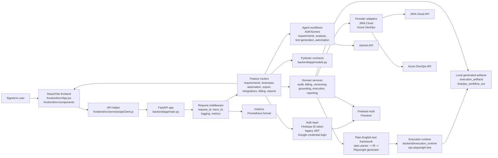

# Architecture

## 1) Architectural Style

Primary style: modular monolith with a layered backend, a React single-page
frontend, and an isolated Playwright execution runtime.

Why this classification:

- `backend/app/main.py` creates one FastAPI application and registers feature
  routers from `backend/app/routers/`.
- Routers delegate domain behavior to service modules, agent modules, adapters,
  and Pydantic contracts in `backend/app/models.py`.
- The frontend is one Vite React app with `App.jsx` as top-level workflow
  orchestration and focused components under `frontend/src/components/`.
- Browser execution is split into a backend Python conversion/service path and
  a Node Playwright runtime under `backend/execution_runtime/`.

Primary constraints:

- User-facing workflow is human-in-the-loop: requirements are parsed/reviewed,
  context can be enriched, test cases are generated/reviewed, exports are gated,
  and execution candidates are previewed before running.
- Agent output must be resilient: parsers, deterministic fallbacks, retry
  diagnostics, and heuristic quality gates protect the workflow from malformed
  model output.
- Source artifacts and credentials must not be retained in git. Generated
  execution artifacts, screenshots, exports, and client briefs are ignored.

## 2) Visual Architecture



The diagram shows the main request path and the two important side paths:
agent-backed generation through Gemini, and executable browser automation
through the plain-English framework plus the isolated Playwright runtime.

## 3) System Flow

```text
React UI -> FastAPI router -> billing/audit guard -> agent/service/adapters -> persistence repositories/Firestore/external API/local artifacts -> Pydantic response -> React UI
```

Typical generate flow:

1. The frontend sends authenticated API requests through helpers in
   `frontend/src/services/apiClient.js` and auth/session orchestration in
   `frontend/src/App.jsx`.
2. FastAPI middleware in `backend/app/main.py` attaches `X-Request-ID`, optional
   trace context, structured request logging, and HTTP metrics.
3. A router in `backend/app/routers/` resolves `AuthUser`, starts an audit
   workflow, checks billing where relevant, validates Pydantic request models,
   and delegates work.
4. Agent modules such as `backend/app/adk_client.py`,
   `backend/app/agents/analysis_agent.py`, and
   `backend/app/agents/test_case_agent.py` orchestrate model calls, parsing,
   and workflow loops. Focused test-case helper modules own coverage metrics,
   review scoring, deterministic fallback output, and response hydration.
5. Service modules persist audit/version/billing/integration metadata through
   repository boundaries and the shared Firestore adapter where configured, or
   return warnings/fallback behavior where the code explicitly supports missing
   Firestore.
6. The router completes audit and billing records, then returns Pydantic
   response models for the frontend to render diagnostics, coverage,
   traceability, exports, or execution results.

Next-version execution flow:

```text
Generated TestCase -> /automation/execution/preview -> executable candidates
selected candidates -> YAML spec -> IR JSON -> Playwright TS spec -> npx playwright test -> report artifacts
```

The conversion and run path is implemented by
`backend/app/services/execution_service.py` and
`backend/plain_english_test_framework/`, with Node runtime configuration in
`backend/execution_runtime/playwright.config.ts`.

## 4) Layer/Module Responsibilities

| Layer or module | Owns | Must not own | Evidence |
|-----------------|------|--------------|----------|
| FastAPI app | App construction, middleware, CORS, router registration, health, metrics | Feature endpoint logic beyond global middleware | `backend/app/main.py` |
| Routers | HTTP contracts, auth dependencies, audit lifecycle calls, billing access calls, endpoint-level errors | Provider HTTP implementation or model prompt design | `backend/app/routers/*.py` |
| Models | Pydantic request/response/data contracts | Runtime business behavior | `backend/app/models.py` |
| Agents | Requirement extraction, analysis, test-case generation orchestration, review/refinement loops, deterministic fallback generation, coverage metrics, response hydration, automation POM generation | HTTP transport and UI rendering | `backend/app/adk_client.py`, `backend/app/agents/*.py` |
| Services | Billing, audit, versioning, reporting, persistence repository boundaries, execution conversion/run, context grounding | Route decorators or React state | `backend/app/services/*.py` |
| Adapters | JIRA and Azure DevOps remote API calls and provider-specific normalization | Cross-provider workflow policy | `backend/app/adapters/*.py` |
| Auth | Firebase token verification, legacy JWT decoding, Google credential login, role/admin checks | Billing, generation, or integration sync logic | `backend/app/auth/*.py` |
| Observability | JSON logging, request context, metrics rendering, optional tracing | Business decisions | `backend/app/observability/*.py` |
| Plain-English framework | Spec parsing, secret detection, environment/data resolution, schema-valid IR generation, Playwright spec generation, local runner | User auth, billing, external integrations | `backend/plain_english_test_framework/*.py` |
| React app | Top-level workflow composition, auth session orchestration, domain workflow hooks, component props, API actions | Backend persistence or agent logic | `frontend/src/App.jsx`, `frontend/src/hooks/`, `frontend/src/components/` |
| Frontend styles | Shared design tokens, base rules, layout styles, and feature-owned selectors imported through one cascade entry point | React state, backend contracts, or visual redesign outside the owning feature | `frontend/src/styles/index.css`, `frontend/src/styles/*.css` |

## 5) Reused Patterns

| Pattern | Where found | Why it exists |
|---------|-------------|---------------|
| FastAPI dependency auth | `Depends(get_current_user)` in routers | Keeps protected endpoint identity resolution consistent |
| Pydantic boundary models | `backend/app/models.py` | Keeps backend API, integration, billing, execution, and export payloads explicit |
| Workflow audit lifecycle | `start_workflow_run()`, `complete_workflow_run()`, `record_usage_event()` | Links operations to request IDs, users, billing, reports, and trace metadata |
| Persistence repository boundary | `audit_repository.py`, `billing_repository.py`, `usage_event_repository.py`, `firestore_repository.py` | Keeps routers and agents insulated from Firestore-specific client setup and gives PostgreSQL adapters a defined insertion point |
| Deterministic fallback | Requirement/test-case agents and automation agent | Keeps workflow usable when model output is malformed, unavailable, or incomplete |
| Safe artifact fetch | `artifact_fetcher.py` plus `context_grounding.py` | Blocks unsafe URLs and returns partial enrichment instead of crashing |
| Provider adapter plus service | JIRA and Azure DevOps adapter/service pairs | Separates remote API mechanics from import/sync workflow policy |
| Local fake/patch tests | `backend/tests/test_*` | Keeps tests independent from real Firestore, JIRA, Azure DevOps, Firebase, and model calls |
| Generated artifact isolation | `.execution_artifacts/`, `client_submission/`, runtime artifact directories | Prevents local outputs, traces, screenshots, and exports from becoming source |

## 6) Known Architectural Risks

- Test-case generation is now split across focused backend helper modules:
  orchestration and prompt builders remain in
  `backend/app/agents/test_case_agent.py`, coverage helpers live in
  `backend/app/agents/test_case_coverage.py`, review helpers live in
  `backend/app/agents/test_case_review.py`, deterministic fallback helpers live
  in `backend/app/agents/test_case_fallback.py`, and response hydration helpers
  live in `backend/app/agents/test_case_hydration.py`. `frontend/src/App.jsx`
  is still the top-level workflow composer, but workflow state is now split into
  domain hooks under `frontend/src/hooks/`, and feature styles are split under
  `frontend/src/styles/` behind `frontend/src/styles/index.css`. Future changes
  should continue moving cohesive behavior and selectors behind those ownership
  boundaries.
- `backend/app/models.py` contains many product domains in one file. This keeps
  contracts discoverable but increases merge and review risk as the API grows.
- Current auth supports Firebase ID tokens and legacy/backend JWT tokens. This
  helps local/E2E workflows, but it can confuse production auth policy unless
  the intended long-term mode remains documented.
- Firestore is the current durable service path for audit, versioning, billing,
  integration mappings, and reports. `docs/persistence-target-decision.md`
  accepts a staged approach: keep Firestore as the transitional runtime store
  and target PostgreSQL for compliance-grade audit, billing, reporting, and
  versioned artifacts. Repository boundaries now isolate audit writes,
  reporting usage-event reads, billing repository access, and Firestore
  collection lookup; PostgreSQL schema, adapter, and migration work remain
  future implementation stories.
- The execution runtime shells out to `npx playwright test`. The artifact root,
  runtime cwd, browser channel, and generated paths need careful configuration
  in every deployment environment.

## 7) Evidence

- `backend/app/main.py`
- `backend/app/models.py`
- `backend/app/routers/requirements.py`
- `backend/app/routers/testcases.py`
- `backend/app/routers/automation.py`
- `backend/app/agents/test_case_agent.py`
- `backend/app/agents/test_case_coverage.py`
- `backend/app/agents/test_case_review.py`
- `backend/app/agents/test_case_fallback.py`
- `backend/app/agents/test_case_hydration.py`
- `backend/app/services/execution_service.py`
- `backend/plain_english_test_framework/compiler.py`
- `backend/plain_english_test_framework/local_runner.py`
- `backend/app/services/artifact_fetcher.py`
- `backend/app/services/context_grounding.py`
- `backend/app/services/audit_service.py`
- `backend/app/services/audit_repository.py`
- `backend/app/services/firestore_repository.py`
- `backend/app/services/usage_event_repository.py`
- `backend/app/services/billing_service.py`
- `frontend/src/App.jsx`
- `frontend/src/components/`
- `frontend/src/styles/`
- `frontend/src/services/apiClient.js`
- `backend/execution_runtime/playwright.config.ts`
